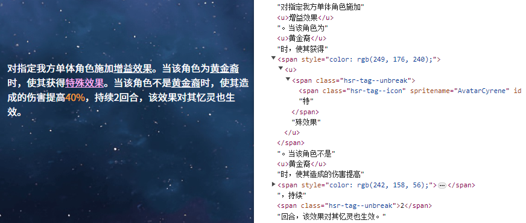

# unity-richtext-parser

一个可扩展的Unity富文本解析器和DOM转换器

## Features

* 采用ANTLR4解析，支持多种富文本标签语法
* 兼容大部分HTML语法，并且支持HTML实体转义如`&lt;`
* 支持UGUI, TextMeshPro, 和UI Toolkit各自的版本
* 针对不同标签的转换器可以扩展和自定义替换
* 支持插值表达式，并且可以自定义插值语法和处理器
* 未知标签和属性可以转换为回退默认元素，默认为`<span>`
* 可以用来处理半结构化的LLM/agent输出内容，混合了大量文本和自定义标签如`<think>`和`<file_content>`


示例：采用了自定义标签解析器、自定义插值处理器并忽略未知标签的HTML渲染结果，数据内容来自游戏《崩坏：星穹铁道》




## 标签语法支持

### 内建语法


* `<br />` 简单自闭标签
* `<u>underline</u>` 简单成对标签
* `<a href="https://github.com">GitHub</a>` 带普通属性的标签，支持成对和自闭形式。属性值只包含字母数字时可以省略引号
* `<color=#FF0000>red text</color>` 默认属性标签，支持成对和自闭形式

### 扩展支持语法

* `<tag="value" attr=value2></tag>` 带有默认属性和普通属性的混合标签


### 注意事项

* 所有标签必须闭合。
  * 未闭合的自闭标签（如`<br>`）在Unity和HTML中是允许的，
  但由于需要准备自闭标签白名单才能和成对标签区分，因此不支持
  * 丢失结束标签的成对标签可能不会造成语法错误，但行为未定义。
  在浏览器的DOM解析中，通常会导致标签内容应用到文档末尾


## 快速开始

```typescript

import UnityRichText from 'unity-richtext-parser';

const text = `<color=#FFFF00>Hello, ${name}!</color>`;
UnityRichText.parseToHTML(desc, {
  name: 'World'
});

// <span style="color: #FFFF00;">Hello, World!</span>

```